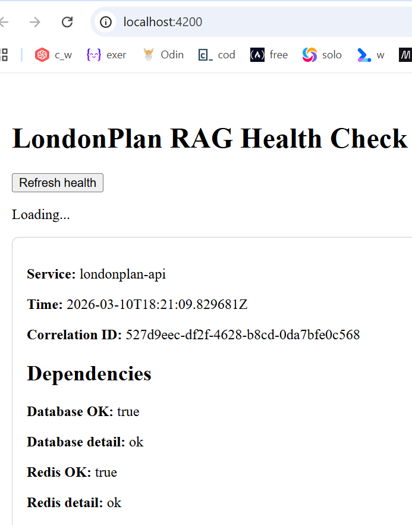
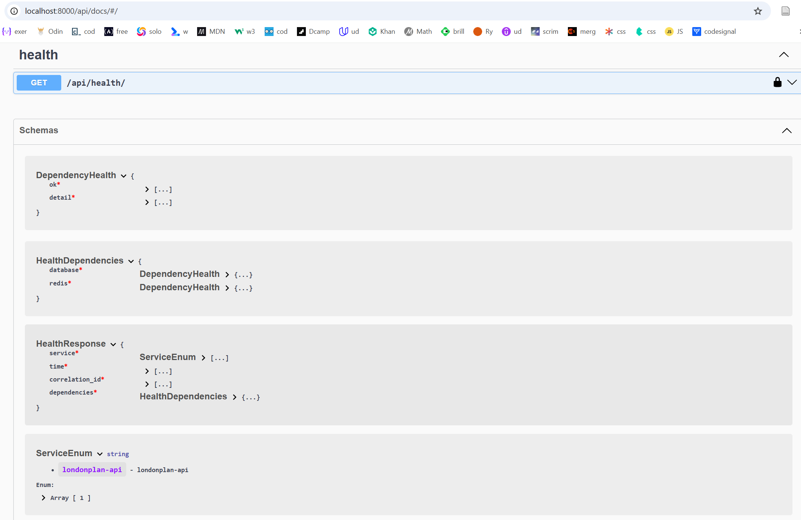

# LondonPlan RAG — Planning & Development Intelligence Copilot

Educational portfolio project demonstrating a regulated-style, AI-adjacent platform architecture using Django, DRF, Angular, OpenAPI contracts, secure defaults, and governance artifacts.

---

## Disclaimer

This repository is an **educational portfolio project** created to demonstrate software architecture, engineering practices, and governance patterns relevant to AI-adjacent systems.

It is **not an official system**, **not affiliated with the Greater London Authority**, and **not intended for production use**.

All planning-related terminology and examples are used solely for **demonstration of architecture and engineering practices**.

---

## Why this project

This project demonstrates how to design an AI-adjacent information system for a regulated-style environment where **traceability, contract discipline, and secure defaults** matter as much as feature delivery.

The focus is on **architecture, reliability, and governance patterns**, not just application features.

---

## What it does

- Provides a health endpoint with dependency validation
- Exposes an OpenAPI schema and Swagger UI
- Demonstrates strict Angular integration against Django
- Shows OpenAPI contract locking and generated client preparation
- Includes security, audit, and governance artifacts

---

## Key engineering signals

This repository is designed to highlight:

- contract-first API development with OpenAPI
- typed frontend-backend integration using Angular and strict TypeScript
- regulated-style engineering patterns such as traceability and governance records
- secure-by-default implementation choices
- dependency validation and health reporting
- repository-level quality gates for structure, security, and contracts

---

## Demo





---

## Architecture

```mermaid
flowchart LR
  A[Angular Client] -->|/api via proxy| B[Django DRF API]
  B --> C[Postgres/PostGIS]
  B --> D[Redis]
  B --> E[OpenAPI Schema]
  E --> F[Generated Angular Client]
  B --> G[AI Governance Artifacts]
````

---

## Example API response

```json
{
  "service": "londonplan-api",
  "time": "2026-03-08T12:30:00Z",
  "correlation_id": "3e1f9d47-3a4d-4d2b-8b9b-54e8d0a4e8f7",
  "dependencies": {
    "database": { "ok": true, "detail": "ok" },
    "redis": { "ok": true, "detail": "ok" }
  }
}
```

---

## Stack

### API

* Django
* Django REST Framework
* drf-spectacular

### Client

* Angular
* Strict TypeScript

### Data

* PostgreSQL / PostGIS
* Redis

### Security

* pre-commit
* gitleaks
* dependency audit
* secure defaults

### Contracts

* OpenAPI export
* OpenAPI contract locking
* generated TypeScript API client

### Governance

* AI prompt catalog
* evaluation records

---

## Project structure

```text
.
├── LICENSE
├── README.md
├── docker-compose.yml
├── api/
├── client/
│   └── londonplan-client/
├── scripts/
├── screenshots/
│   ├── angular-health-page.png
│   └── swagger-ui.png
└── ...
```

---

## Local development

### Infrastructure

Start the supporting services first:

```powershell
docker compose up -d postgres redis
```

### Backend

```powershell
Set-Location .\api
.\.venv\Scripts\Activate.ps1

python manage.py migrate
python manage.py runserver 0.0.0.0:8000
```

Swagger UI:

```text
http://localhost:8000/api/docs/
```

### Frontend

```powershell
Set-Location .\client\londonplan-client
npm start
```

Angular dev server:

```text
http://localhost:4200
```

If a command hangs or you need to stop a running process, press:

```text
CTRL + C
```

---

## Full Docker stack

Run the full application stack with:

```powershell
docker compose up --build
```

---

## Quality gates

Run repository validation checks:

```powershell
.\scripts\tree-check.ps1
.\scripts\gates.ps1
.\scripts\audit-python.ps1
```

These checks are intended to verify repository structure, baseline quality controls, and dependency posture.

---

## OpenAPI contract workflow

### Export OpenAPI schema

```powershell
.\scripts\export-openapi.ps1
```

### Verify contract lock

```powershell
.\scripts\check-openapi-lock.ps1
```

### Generate Angular API client

```powershell
Set-Location .\client\londonplan-client
npm run generate:api
```

This workflow reinforces contract discipline between the Django API and Angular client.

---

## Security-by-design decisions

* correlation ID propagation
* secure cookie and browser header defaults
* secret scanning with pre-commit
* dependency auditing with pip-audit and safety
* governance artifacts versioned alongside code

---

## Operational posture

This repository is intentionally positioned as a portfolio-grade and governance-aware reference project. It emphasizes:

* traceability over feature sprawl
* contract stability over ad hoc integration
* secure defaults over convenience-first configuration
* explainable repository structure over hidden assumptions

---

## Roadmap

* add sample planning document endpoint
* add query preview endpoint with citations
* integrate generated Angular client fully
* add CI contract checks and broader tests
* add sample ingestion pipeline

---

## Limitations

* current domain functionality is intentionally minimal
* no production authentication or authorization yet
* RAG flow is represented by governance and contract foundations rather than a full retrieval pipeline

---

## License

This project is licensed under the MIT License.

Copyright (c) 2026 Cherry Augusta

See the [LICENSE](./LICENSE) file for full details.

---
